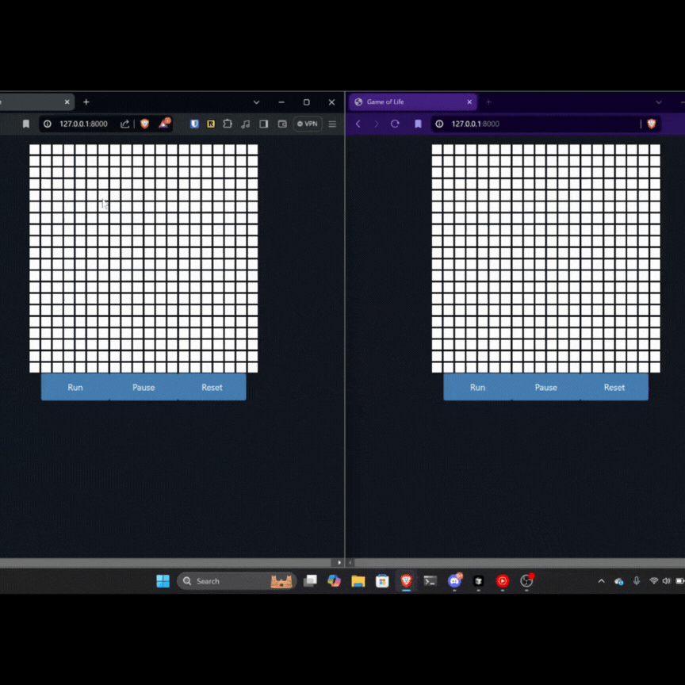

# Game of Life in FastHTML

This project implements [Conway's Game of Life](https://en.wikipedia.org/wiki/Conway%27s_Game_of_Life) using FastHTML, showcasing real-time updates and multi-client synchronization through WebSockets.



## Features

- Interactive Game of Life grid
- Real-time updates across multiple clients
- WebSocket integration for live synchronization
- Simple controls: Run, Pause, and Reset

## Live Demo

Try out the live version hosted on Railway: [Game of Life Demo](https://game-of-life-production-ed7f.up.railway.app/)

## Technology Stack

- [FastHTML](https://github.com/AnswerDotAI/fasthtml): A Python framework for building dynamic web applications
- WebSockets: For real-time communication between server and clients
- HTMX: For seamless client-side updates without full page reloads

## Implementation Highlights

### Game Logic

The core Game of Life logic is implemented in the `update_grid` function courtesy of ChatGPT:

```python
def update_grid(grid: list[list[int]]) -> list[list[int]]:
    new_grid = [[0 for _ in range(20)] for _ in range(20)]
    def count_neighbors(x, y):
        directions = [(-1, -1), (-1, 0), (-1, 1), (0, -1), (0, 1), (1, -1), (1, 0), (1, 1)]
        count = 0
        for dx, dy in directions:
            nx, ny = x + dx, y + dy
            if 0 <= nx < len(grid) and 0 <= ny < len(grid[0]): count += grid[nx][ny]
        return count
    for i in range(len(grid)):
        for j in range(len(grid[0])):
            neighbors = count_neighbors(i, j)
            if grid[i][j] == 1:
                if neighbors < 2 or neighbors > 3: new_grid[i][j] = 0
                else: new_grid[i][j] = 1
            elif neighbors == 3: new_grid[i][j] = 1
    return new_grid
```

This function determines how the game world evolves over time by applying the rules of Conway's Game of Life to the cells in the grid.

### Grid Rendering and User Interaction

The grid is rendered using FastHTML components:

```python
def Grid():
    cells = []
    for y, row in enumerate(game_state['grid']):
        for x, cell in enumerate(row):
            cell_class = 'alive' if cell else 'dead'
            cell = Div(cls=f'cell {cell_class}', hx_put='/update', hx_vals={'x': x, 'y': y}, hx_swap='none', hx_target='#gol', hx_trigger='click')
            cells.append(cell)
    return Div(*cells, id='grid')

@rt('/update')
async def put(x: int, y: int):
    game_state['grid'][y][x] = 1 if game_state['grid'][y][x] == 0 else 0
    await update_players()
```

Above is a component for representing the game's state that the user can interact with and update on the server using cool HTMX features such as `hx_vals` for determining which cell was clicked to make it dead or alive. We use `hx_put` to send a PUT request to the server to update the game state rather than a POST request, which would have returned a new Grid component with the updated state since we want to handle that via websockets so all clients can see the changes rather than only the client that initiated the change.

### FastHTML and WebSocket Integration

FastHTML handles WebSocket connections with ease:

```python
@app.ws('/gol', conn=on_connect, disconn=on_disconnect)
async def ws(msg:str, send): pass

player_queue = []
async def on_connect(send): player_queue.append(send)
async def on_disconnect(send): await update_players()
```

The `@app.ws` decorator sets up the WebSocket endpoint, while `on_connect` and `on_disconnect` manage the player queue. Similar to all of HTMX, you send HTML snippets, or in our case FastHTML components, to the client to update the page. There is only one difference with standard HTMX updating of HTML on the client and how it is done via websockets, that being all swaps are OOB. You can find more information on the HTMX websocket extension documentation page [here](https://github.com/bigskysoftware/htmx-extensions/blob/main/src/ws/README.md).

### Real-time Updates

A background task continuously updates the game state and notifies clients:

```python
async def update_players():
    for i, player in enumerate(player_queue):
        try: await player(Grid())
        except: player_queue.pop(i)

async def background_task():
    while True:
        if game_state['running'] and len(player_queue) > 0:
            game_state['grid'] = update_grid(game_state['grid'])
            await update_players()
        await asyncio.sleep(1.0)

background_task_coroutine = asyncio.create_task(background_task())
```

`update_players()` sends the current game state to all connected clients, updating their visuals in real-time and removing any players that have disconnected.

## Running Locally

To run the app locally:

1. Clone the repository
2. Navigate to the project directory
3. Install dependencies (if any)
4. Run the following command: `uvicorn main:app --reload`
