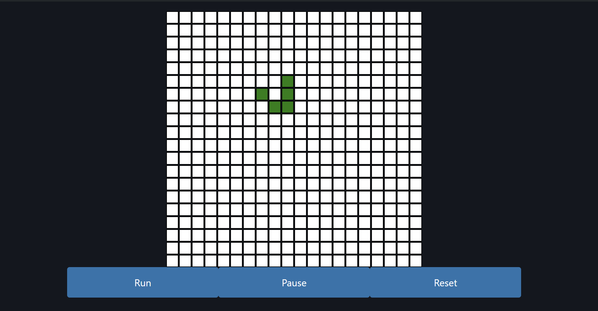

# Game of Life

This example implements the famous Conway's Game of Life all in fasthtml! It utilizes websockets to keep the game in sync between clients and allows for multiple people to play at once.

To run locally, run `uvicorn main:app` from this directory. You can also play with a hosted version on railway [here](https://game-of-life-production-ed7f.up.railway.app/).