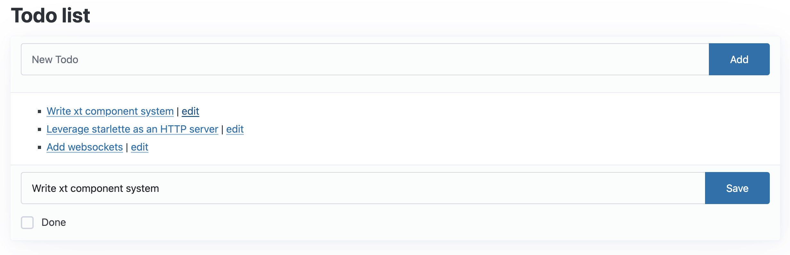

# FastHTML Todo App

This project implements a simple Todo list application using FastHTML, showcasing dynamic updates and database integration.



## Features

- Add, edit, and delete todo items
- Mark todos as complete
- Real-time updates without page reloads
- SQLite database integration

## Technology Stack

- [FastHTML](https://github.com/AnswerDotAI/fasthtml): A Python framework for building dynamic web applications
- HTMX: For seamless client-side updates without full page reloads
- SQLite: For persistent data storage

## Implementation Highlights

### App Setup and Database Integration

FastHTML makes it easy to set up a database-backed application:

```python
app,rt,todos,Todo = fast_app(
    'data/todos.db',
    hdrs=[Style(':root { --pico-font-size: 100%; }')],
    id=int, title=str, done=bool, pk='id')
```

This single line sets up our app, routing, database connection, and Todo data model model using the `fast_app` function. However, you can use the standard `FastHTML` class to set up your app and `database` function from [`fastlite`](https://github.com/AnswerDotAI/fastlite) to create your database manually.

```python
app = FastHTML(hdrs=[Style(':root { --pico-font-size: 100%; }')])
rt = app.route
db = database('todos.db')
if 'Todo' not in db.t: db.t['Todo'].create(id=int, title=str, done=bool, pk='id')
Todo = db.t['Todo'].dataclass()
```

### Todo Item Rendering

Each todo item is rendered as an HTML component:

```python
@patch
def __ft__(self:Todo):
    show = AX(self.title, f'/todos/{self.id}', id_curr)
    edit = AX('edit',     f'/edit/{self.id}' , id_curr)
    dt = ' ✅' if self.done else ''
    return Li(show, dt, ' | ', edit, id=tid(self.id))
```

This method defines how each Todo object is displayed, including its title, completion status, and edit link. We are taking advantage of monkey patching via the `@patch` decorator to add new functionality to the Todo class. If you want to learn more about monkey patching, check out this [article](https://en.wikipedia.org/wiki/Monkey_patch).

### Adding New Todos

Here is how we setup the form for adding new todos:

```python
def mk_input(**kw): return Input(id="new-title", name="title", placeholder="New Todo", **kw)

@rt("/")
def get():
    add = Form(Group(mk_input(), Button("Add")),
               hx_post="/", target_id='todo-list', hx_swap="beforeend")
    card = Card(Ul(*todos(), id='todo-list'),
                header=add, footer=Div(id=id_curr)),
    title = 'Todo list'
    return Title(title), Main(H1(title), card, cls='container')
```

This creates an input field and "Add" button, which uses HTMX to post new todos without a page reload.

### Editing Todos

Editing a todo item is handled by this route which takes the todo's id as a parameter:

```python
@rt("/edit/{id}")
def get(id:int):
    res = Form(Group(Input(id="title"), Button("Save")),
        Hidden(id="id"), CheckboxX(id="done", label='Done'),
        hx_put="/", hx_swap="outerHTML", target_id=tid(id), id="edit")
    return fill_form(res, todos.get(id))
```

This allows us to dynamically fill the form with the todo's current data, allowing for easy editing.
**TIP:** What happens when `hx_swap="outerHTML"` is removed?  
**Answer:** When `hx_swap="outerHTML"` is omitted, the default behavior is to replace only the inner HTML of the target element. This results in a nested structure `<li><li>...</li></li>` instead of replacing the entire list item. Using `hx_swap="outerHTML"` ensures that the target element itself is replaced, preventing such nesting issues

### Deleting Todos

Similarly, we can do the same for deleting todos, except we use the `delete` method instead of `get`:

```python
@rt("/todos/{id}")
def delete(id:int):
    todos.delete(id)
    return clear(id_curr)
```

## Running Locally

To run the app locally:

1. Clone the repository
2. Navigate to the project directory
3. Install dependencies (if any)
4. Run the following command: `python main.py`

