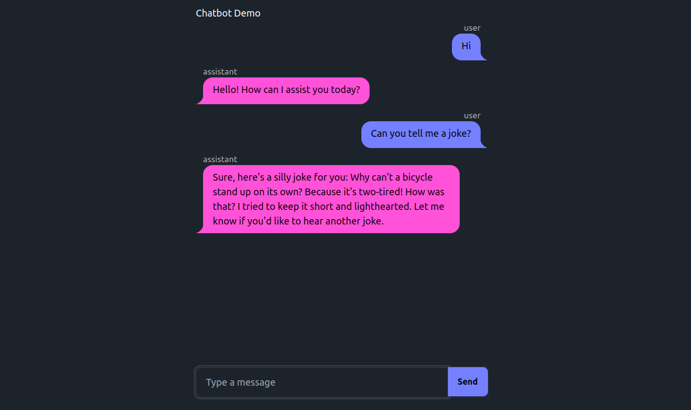

# Chatbot Demo

This example implements a simple chatbot, showcasing custom styling with [DaisyUI](https://daisyui.com/), along with some different approaches to handling the chat message updates. The chat functionality is handled by [claudette](https://claudette.answer.ai/), a friendly wrapper around the Anthropic API. 



There are three versions of the example:

- `basic.py`: A minimal version of the app, showing the chat bubble styling as described in [this tutorial](https://fhdocs.answer.ai/by_example.html#full-example-3---chatbot-example-with-daisyui-components).
    - `basic_openai.py`: A version of the basic chatbot that uses the OpenAI API instead of the Anthropic API.
- `polling.py`: Extending the basic chatbot with a polling mechanism so that the UI updates as soon as the user sends a message, and then streams the response from the chat model.
- `ws.py`: Extending the basic chatbot to use websockets. And `ws_streaming.py` with tweaks to stream the response from the chat model in chunks.

To run the examples, first set your API key: `export ANTHROPIC_API_KEY=your_api_key_here`, and then run the example with `python basic.py` (or `polling.py`, etc.).

## Styling

[DaisyUI](https://daisyui.com/) is a 'component library'. It is built on top of [Tailwind CSS](https://tailwindcss.com/), and provides a set of components that can be used to quickly build a web application. In this example, show how to take a component like the [chat bubble](https://daisyui.com/components/chat/) and use it in a FastHTML application. Tailwind CSS uses special CSS classes to style elements, and DaisyUI extends this with additional classes for more complex components - in our case things like `chat-bubble-primary` and `chat-header`. 

To use DaisyUI in a FastHTML application, we can add the CSS and JS files to the HTML head:

```python
tlink = Script(src="https://cdn.tailwindcss.com"),
dlink = Link(rel="stylesheet", href="https://cdn.jsdelivr.net/npm/daisyui@4.11.1/dist/full.min.css")
app = FastHTML(hdrs=(tlink, dlink, picolink))
```

Then we can define a function to create a chat message. In HTML (as shown in the DaisyUI docs) a message might look like this:
    
```html
<div class="chat chat-start">
  <div class="chat-header">
    Obi-Wan Kenobi
    <time class="text-xs opacity-50">2 hours ago</time>
  </div>
  <div class="chat-bubble">You were the Chosen One!</div>
  <div class="chat-footer opacity-50">Seen</div>
</div>
```

We can make a ChatMessage component that sets the right classes for our use-case like so:


```python
def ChatMessage(msg):
    bubble_class = f"chat-bubble-{'primary' if msg['role'] == 'user' else 'secondary'}"
    chat_class = f"chat-{'end' if msg['role'] == 'user' else 'start'}"
    return Div(Div(msg['role'], cls="chat-header"),
               Div(msg['content'], cls=f"chat-bubble {bubble_class}"),
               cls=f"chat {chat_class}")
```

Then in the main page, we make a Div (with the `chat-box` class) that contains a list of chat messages, and a form with an input field and a submit button for the user to enter messages:

```python
@app.route("/")
def get():
    page = Body(H1('Chatbot Demo'),
                Div(*[ChatMessage(msg) for msg in messages],
                    id="chatlist", cls="chat-box h-[73vh] overflow-y-auto"),
                Form(Group(ChatInput(), Button("Send", cls="btn btn-primary")),
                    hx_post="/", hx_target="#chatlist", hx_swap="beforeend",
                    cls="flex space-x-2 mt-2",
                ), cls="p-4 max-w-lg mx-auto")
    return Title('Chatbot Demo'), page
```

As you can see, we can quickly create reusable components with FastHTML, even with unfamiliar tools like Tailwind CSS.

## Basic Funtionality

The `hx_post="/", hx_target="#chatlist", hx_swap="beforeend"` attributes on the form tell htmx to send the form data to the server, and then update the `chatlist` div with the new chat message. In the basic version of the app, we receive the message, send it to the chat model, and then send the response back to the client:

```python
@app.post("/")
def post(msg:str):
    messages.append({"role":"user", "content":msg})
    r = cli(messages, sp=sp) # get response from chat model
    messages.append({"role":"assistant", "content":contents(r)})
    return (ChatMessage(messages[-2]), # The user's message
            ChatMessage(messages[-1]), # The chatbot's response
            ChatInput()) # And clear the input field via an OOB swap
```

This works, but the UI only updates after the server has processed the message and sent the response back. There's a lag between the user sending a message and seeing any change in the UI. There are a few ways to address this, which we'll explore in the next sections.

## Polling

In this version, when a client sends a message, the server immediately sends back the chat bubbles for the user's message and the chatbot's response (the latter an empty message initially). This casues the UI to update immediately. It also starts a separate thread, where the message is sent to the chat model, and the response is streamed back. We modify the ChatMessage function so that for messages that are still generating, it polls the server every 0.1 seconds to update itself with the latest content, using `hx_trigger="every 0.1s"`. Once the message is complete, the polling stops.

## Websockets

As an alternative, we can use the `websockets` [extension of htmx](https://v1.htmx.org/extensions/web-sockets/) to handle communication between the client and the server. To do this, add the requisite headers by passing `ws_hdr=True` to the FastHTML constructor, and then use the `hx_ext="ws"` attribute in the form to specify that the form should be submitted via websockets. We specify the route, and then in the form use `ws_send=""` so that it sends a message to the websocket (as opposed to the default behavior of sending the form data):

```python
Form(Group(ChatInput(), Button("Send", cls="btn btn-primary")),
     ws_send="", hx_ext="ws", ws_connect="/wscon")
```

Then in the websocket handler, we can send multiple messages to the client:

```python
@app.ws('/wscon')
async def ws(msg:str, send):

    # Send the user message to the user (updates the UI right away)
    messages.append({"role":"user", "content":msg})
    await send(Div(ChatMessage(messages[-1]), hx_swap_oob='beforeend', id="chatlist"))

    # Send the clear input field command to the user
    await send(ChatInput())

    # Get and send the model response
    r = cli(messages, sp=sp)
    messages.append({"role":"assistant", "content":contents(r)})
    await send(Div(ChatMessage(messages[-1]), hx_swap_oob='beforeend', id="chatlist"))
```

For more on websockets, see the [htmx documentation](https://v1.htmx.org/extensions/web-sockets/), the ['Game Of Life' example](https://github.com/AnswerDotAI/fasthtml-example/tree/main/00_game_of_life), the ['basic_ws.py` example](https://github.com/AnswerDotAI/fasthtml/blob/main/examples/basic_ws.py) or the [Starlette documentation](https://www.starlette.io/websockets/).

When streaming the response from the model, we could repeatedly send a chat message with the content so far, replacing the previous message. This looks fine but has some subtle issues, for example if the user starts selecting text while the message is still streaming in, the selection will be lost when the message is updated. Instead, we can add new content to the end of the message with something like this (as shown in `ws_streaming.py`):

```python
for chunk in r:
    messages[-1]["content"] += chunk
    await send(Span(chunk, id=f"chat-content-{len(messages)-1}", hx_swap_oob="beforeend"))
```

A final note: in cases like this where the server sends multiple messages to the client, [Server Sent Events](https://v1.htmx.org/docs/#websockets-and-sse) might be an even better choice than websockets.

## Extending this further

This example is missing a number of features we'd expect in a chatbot! Hopefully it illustrates some key ideas. To extend this further, you might want to:
- Add a 'clear chat' button
- Support multiple users
- Explore ways to show a history of past chats, perhaps with the DaisyUI [drawer](https://daisyui.com/components/drawer/) component
- Support markdown in the chat messages
- ...

If you build something cool, let us know!