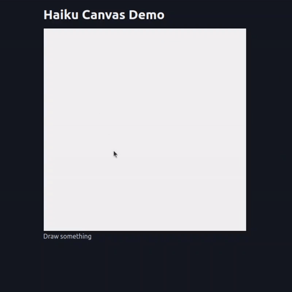

# AI Pictionary

This example shows a drawing app that uses some custom javascript for the drawing canvas and an AI model that processes the resulting drawings.



There is also a more complex version (still a work in progress) included in the 'multiplayer_prototype' folder, with a queue system, game replays, multiple models guessing at the same time, and more. This example will likely be updated soon.

## Running the app

The simple version of the app uses Anthropic's Haiku model, so you need to set up an Anthropic API key. You can get one by signing up at [https://anthropic.com/](https://anthropic.com/). Once you have your key, you can run the app with:

```bash
export ANTHROPIC_API_KEY=your_api_key
python app.py
```

## How it works

The user draws on an HTML canvas. This example doesn't use HTMX. Instead, some custom JavaScript (written by ChatGPT) sets up the drawing canvas and sends the drawing data to the server any time a line is drawn. Whatever response the server sends back is displayed as a caption below the canvas.

```javascript
function sendCanvasData() {
  canvas.toBlob((blob) => {
    const formData = new FormData();
    formData.append('image', blob, 'canvas.png');

    fetch('/process-canvas', {
      method: 'POST',
      body: formData,
    }).then(response => response.json())
      .then(data => {
        document.getElementById('caption').innerHTML = data.caption;
        console.log(data);})
      .catch(error => console.error('Error:', error));
  });
}
```

The server receives the image data, processes it with the Anthropic model, and sends back the caption.

```python
@app.post("/process-canvas")
async def process_canvas(image: str):
    image_bytes = await image.read()
    image_base64 = base64.b64encode(image_bytes).decode('utf-8')
    message = client.messages.create(
        model="claude-3-haiku-20240307",
        max_tokens=100,
        temperature=0.5,
        messages=[
           {"role": "user",
            "content": [
                {"type": "image",
                "source": {"type": "base64","media_type": "image/png",
                "data": image_base64}},
                {"type": "text",
                "text": "Write a haiku about this drawing, respond with only that."}
            ]}]
    )
    caption =  message.content[0].text.replace("\n", "<br>")
    return JSONResponse({"caption": caption})
```

## Getting Fancy

The obvious next step was to turn this into a game of pictionary! We'll have a video up soon showing the current state, and hopefully a more polished version will be along not long after that. The current messy code is included in the 'multiplayer_prototype' folder for the curious, and results in an app that looks like this:


The extra functionality was relatively easy to add thanks to FastHTML, although no library can save you from bad styling or messy AI-generated code - hence the need for a bit of a refactor before this is ready for prime time ;)