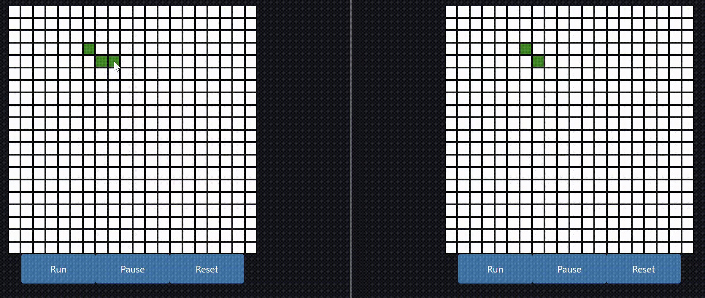

# FastHTML Example Apps

This repository contains a collection of example applications built using FastHTML, demonstrating various features and use cases. Here are some of the highlighted apps:

## 1. Game of Life

An interactive implementation of Conway's Game of Life, showcasing real-time updates and multi-client synchronization through WebSockets.

Key features:
- Interactive Game of Life grid
- Real-time updates across multiple clients
- WebSocket integration for live synchronization

[View Game of Life App](00_game_of_life/)

## 2. Todo App

A simple yet functional Todo list application demonstrating dynamic updates and database integration.

Key features:
- Add, edit, and delete todo items
- Mark todos as complete
- Real-time updates without page reloads
- SQLite database integration

[View Todo App](01_todo_app/)

## 3. Chatbot

A simple chatbot, showcasing custom styling with [DaisyUI](https://daisyui.com/) for the chat message bubbles. Includes different approaches to handling chat message updates.

[View Chatbot App](02_chatbot/)

## 4. Pictionary

Sending user drawings to a multi-modal AI model for continuous captioning.

[View Pictionary App](03_pictionary/)

## Running the Apps

Each app is contained in its own directory. To run an app:

1. Navigate to the app's directory
2. Install the required dependencies (usually with `pip install -r requirements.txt`)
3. Run the app using the command specified in the app's README (typically `uvicorn main:app` or `python main.py`)

## Contributing

Contributions are welcome! Please feel free to submit a Pull Request.

## License

[MIT License](LICENSE)

## Acknowledgements

These examples were created to showcase the capabilities of [FastHTML](https://github.com/AnswerDotAI/fasthtml), a Python framework for building dynamic web applications.