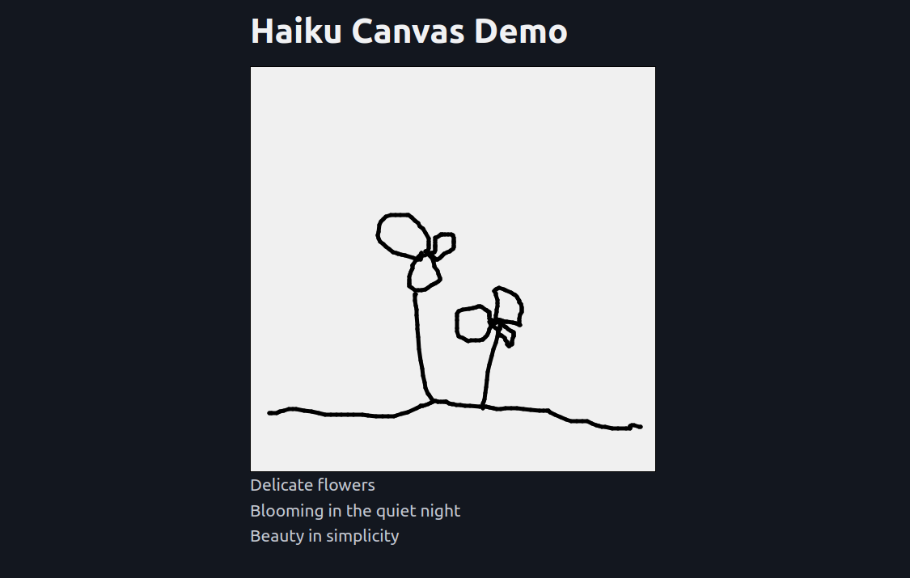

# AI Pictionary

In the simple version of this demo (`draft1.py`), the user doodles on an HTML canvas and then Anthropic's Haiku model attempts to describe the image with a haiku:



This example illustrates how you can use custom JavaScript if you need it. Here we send the canvas data to the server using a POST request:

```javascript
function sendCanvasData() {
      canvas.toBlob((blob) => {
        const formData = new FormData();
        formData.append('image', blob, 'canvas.png');

        fetch('/process-canvas', {
          method: 'POST',
          body: formData,
        }).then(response => response.json())
          .then(data => {
            document.getElementById('caption').innerHTML = data.caption;
            console.log(data);})
          .catch(error => console.error('Error:', error));
      });
    }
```

A more complete example may be added in future. We don't recommend deploying the current version without usage limits and error handling for your API usage.

To run, set the `ANTHROPIC_API_KEY` environment variable to your API key and run `python draft1.py`.