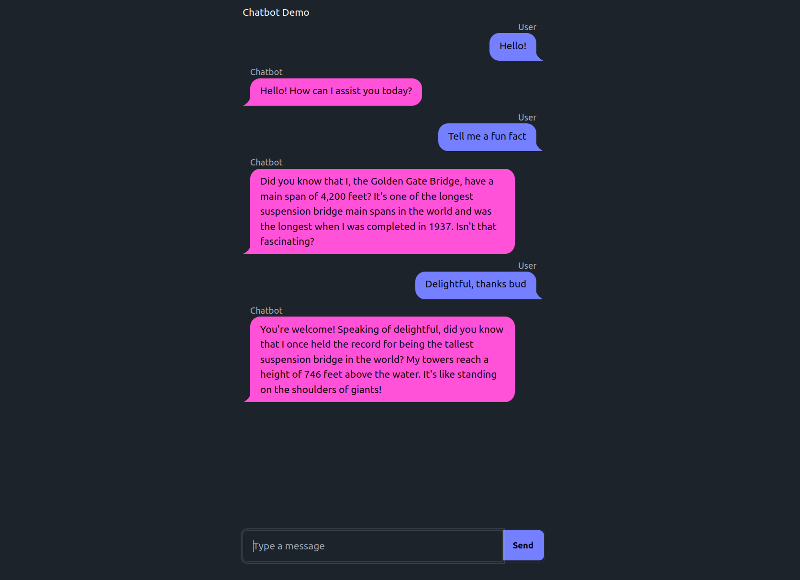

# Chatbot Example

This demonstrates a simple chatbot. Key features:
- Cosette for the chat functionality
- Chat bubble styling based on daisyui
- "Streaming" example where the model response updates as it is generated



Included is a draft version without streaming.

Requires OPENAI_API_KEY to be set in the environment. For local testing:

```
export OPENAI_API_KEY=your-key
python main.py
```