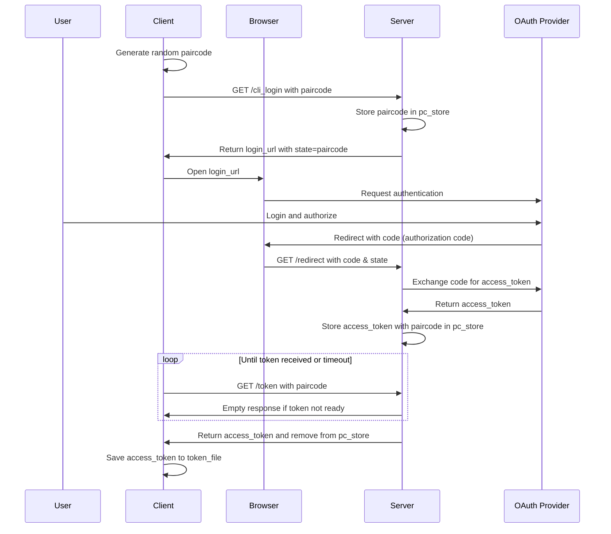

# CLI Authentication with OAuth Example

This example shows how to implement OAuth authentication for CLI apps using FastHTML.
It allows users to authenticate with providers like Google and GitHub without manually copying tokens - similar to popular CLIs like GitHub and Railway.

## Files

- `cli-server.py` - The server component that handles OAuth redirects and token management
- `cli-client.py` - The client component that initiates login and stores the authentication token

## Usage

1. Start the server:
   ```
   python cli-server.py
   ```

2. In another terminal, run the client:
   ```
   python cli-client.py
   ```

3. A browser window will open for authentication
4. After successful login, the access token is saved to `auth_token.txt`
5. The client can now use the access token to make authenticated requests

## How It Works

The authentication flow follows these steps:

1. **Client Initialization**: 
   - The client generates a random `paircode` as a unique identifier for this authentication session
   - This `paircode` connects the CLI process to the browser authentication flow

2. **Server Communication**:
   - The client sends the `paircode` to the server
   - The server stores this `paircode` temporarily and returns a login URL
   - The login URL includes the `paircode` as state parameter

3. **User Authentication**:
   - The client opens the login URL in the user's browser
   - The user authenticates with the OAuth provider
   - After approval, the provider redirects back with an authorization code (named `code` in the `cli-server.py`)

4. **Token Exchange**:
   - The server receives the authorization code and the state (`paircode`)
   - It exchanges the temporary authorization code for a longer-lived `access_token`
   - The server associates this `access_token` with the original `paircode`

5. **Token Retrieval**:
   - The client polls the server asking for the token using the `paircode`
   - Once available, the server returns the `access_token` and removes it from storage
   - The client saves this token locally for future authenticated requests

Visual representation of the flow:



## Final Notes

The server uses a dictionary to store paircodes and access tokens. In production, consider using a database.

For more detailed information about OAuth implementation in FastHTML, see the [OAuth documentation](https://fastht.ml/docs/explains/oauth.html).