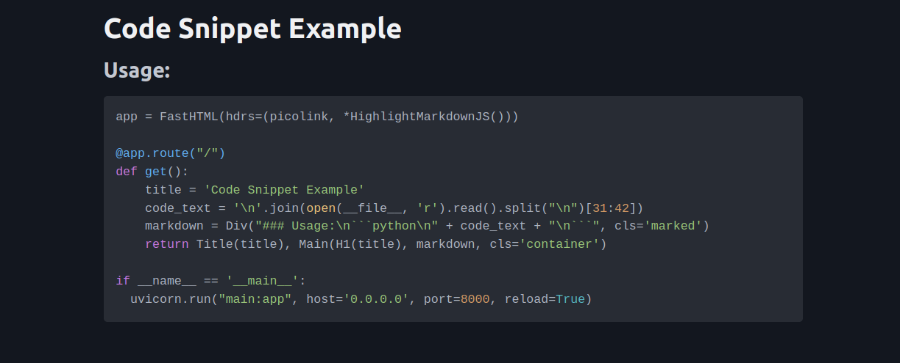

# Syntax Highlighting

Showing how to add code syntax highlighting and easy copying to clipboard.

Uses [highlight.js](https://highlightjs.org/) and [marked](https://marked.js.org/).

Include all the links and scripts in your headers then add markdown to a div with the class `marked` (or anything, configured by setting the selector `sel`) and any code in it will be highlighted and have a copy button.