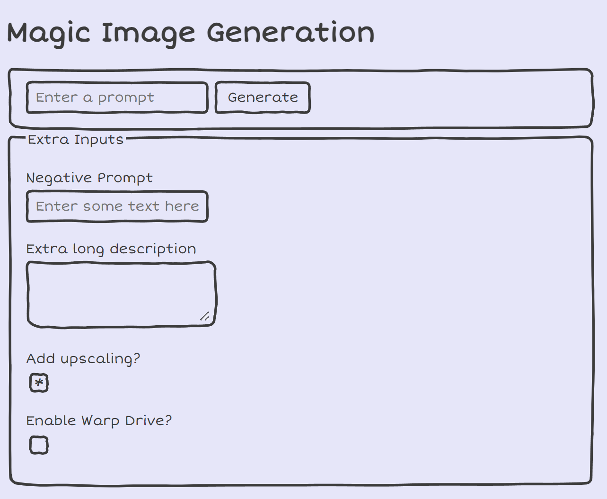

# Doodle Demo

This uses [Doodle CSS](https://chr15m.github.io/DoodleCSS/) to render a form in a doodle style. The app is non-functional - see image_app_* for functional versions with a different aesthetic.

The main doodle.css file and necessary extra files (SVGs of boxes etc) are downloaded from the Doodle CSS GitHub repo.
On larger projects you might organize these into a separate folder ('/static/doodle').
The Doodle CSS library and this demo are licensed under the MIT license - a copy is included in this folder.