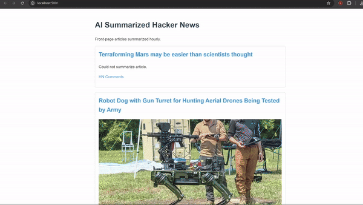

# Hacker News Re-Skin

Creating a version of HN that shows the top stories in a more visually appealing way.

Key features:

- Get the top stories from Hacker News every hour
- Use AI to summarize the stories
- Display the stories in a visually appealing way (including an image for each story if available)

The styling is currently quite minimal - we encourage you to make your own crazy-looking versions!

Requires setting OPENAI_API_KEY in your environment variables.

A version of this is used for [distilhn.com](https://distilhn.com).