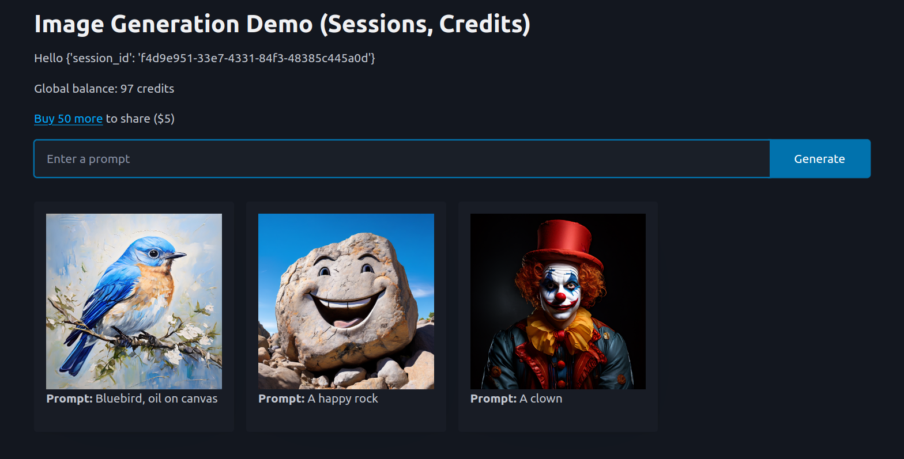

# Image Generation App with 'Credits'

This example builds on the `image_app_simple` example by adding a credit system. There is a global pool of credits. Generating an image uses up one credit. Users can donate credits to the pool (currently 50 credits for $1). The app will not generate images if there are not enough credits in the pool. You only see your images (since we use a session cookie to link a user to their images), but the credits are shared among all users.

You can view the live demo here: https://image-gen-public-credit-pool-production.up.railway.app/

Handling payments requires some setup on the Stripe side. See [here](https://answerdotai.github.io/fasthtml/by_example.html#again-with-credits) for more information and a link to a tutorial.

This app requires setting REPLICATE_API_KEY as a variable in the Railway project or as an environment variable for running locally, as well as STRIPE_KEY and STRIPE_WEBHOOK_SECRET for handling payments. You also need to set a DOMAIN variable with the URL of your app (e.g. `https://image-gen-public-credit-pool-production.up.railway.app`).