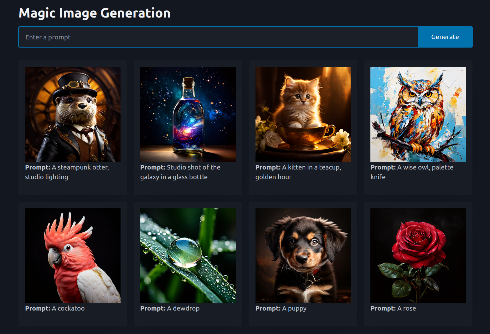

# Image Generation UI

This example shows an interface for a text-to-image model. The user enters a description and the model generates an image. Results are shown in a nice grid that is responsive to the size of the screen.

This app requires setting REPLICATE_API_KEY as a variable in the Railway project or as an environment variable for running locally.

**WARNING**: Deploying this publically will 1) let anyone see all images generated and 2) let anyone generate images (using up your replicate credits). We recommend NOT doing this! See the `image_app_session_credits` example for one that adds usage limits and the ability for users to donate "credits" to the public pool.