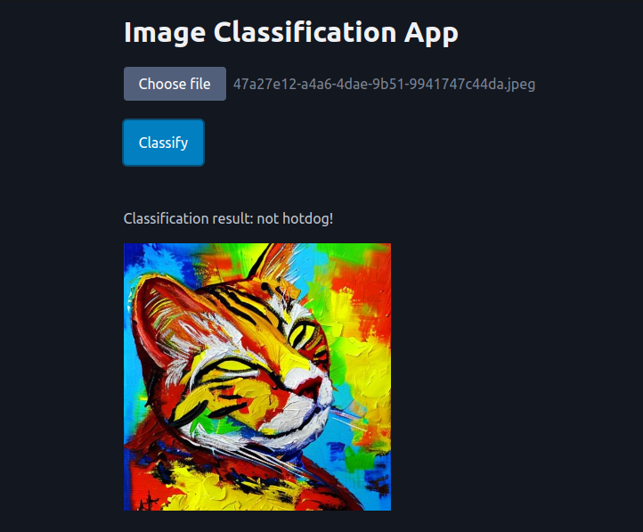

# Image Classification App

This example shows a simple image classification app. A form with a file input field is used to upload an image. The image is then displayed on the page and the model predicts the class of the image.



You could also get the image from the request manually, like so:

```python
@app.post("/classify")
async def handle_classify(request):
    data = await request.form()
    image = data["image"]
    ...
```