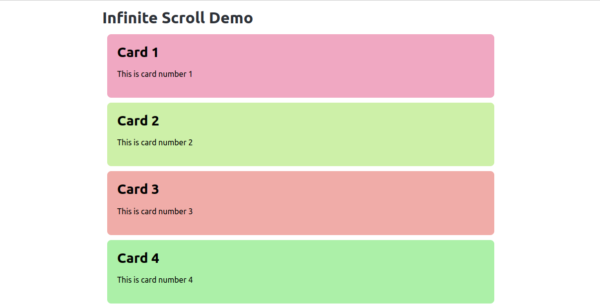

# Infinite Scroll

To create the illusion of infinite scrolling, we add a div offscreen that will trigger a new request when it comes into view. This is done by using the `hx_trigger="intersect once"` attribute on the offscreen div. This will trigger a request when the div comes into view and only trigger it once. For slow-loading content, you can place this, say, 5 elements before the end of the current content to give the browser time to load the new content before the user reaches the end. Here we simply add it after the last card.

```python
@app.get("/more-cards")
def more_cards(request):
    # Get the current count from the query parameters
    start = int(request.query_params.get("start", 21))
    end = start + 20
    
    new_cards = [create_card(i) for i in range(start, end)]
    
    return *new_cards, Div(
            hx_get=f"/more-cards?start={end}",
            hx_trigger="intersect once",
            hx_swap="afterend",
            hx_target="this"
        )
```

